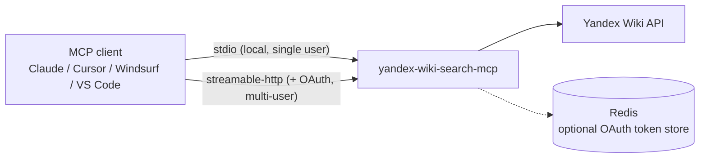

**English** | [Русский](README_ru.md)

# Yandex Wiki Search MCP

[](https://pypi.org/project/yandex-wiki-search-mcp/)
[](https://pypi.org/project/yandex-wiki-search-mcp/)
[](https://github.com/dlbolshov/yandex-wiki-search-mcp/actions/workflows/test.yml)
[](LICENSE)
[](https://github.com/dlbolshov/yandex-wiki-search-mcp/pkgs/container/yandex-wiki-search-mcp)

Connect Claude, Cursor, Windsurf, or any MCP client to **Yandex Wiki**: full-text search,
pages, comments, attachments, and dynamic tables ("grids") — **26 tools** with typed schemas.

- 🔍 **Full-text search** across the entire wiki — the same backend that powers the Wiki web search bar, up to 50 results per query
- 📄 **Full page lifecycle** — create, update, append (top / bottom / anchor), delete with a recovery token, comments, file uploads
- 📊 **Dynamic tables (grids)** — 11 write tools: rows, columns, cells, copy, sort
- 🔒 **Server-side read-only mode** — `WIKI_READ_ONLY=true` simply doesn't register write tools, so the agent can't bypass it
- 🧩 **Typed tool surface** — every tool ships input *and* output JSON schemas plus safety annotations (read-only / destructive / idempotent hints)
- 🐳 **Runs anywhere** — stdio for desktop clients, streamable-http + Docker (with optional multi-user OAuth) for teams

## Quick start

1. Get a Yandex OAuth token with Wiki access ([official guide](https://yandex.ru/support/wiki/ru/api-ref/access)) and your organization ID.
2. Install into your client:

[](https://cursor.com/install-mcp?name=yandex-wiki-search&config=eyJjb21tYW5kIjoidXZ4IiwiYXJncyI6WyJ5YW5kZXgtd2lraS1zZWFyY2gtbWNwIl0sImVudiI6eyJXSUtJX1RPS0VOIjoiWU9VUl9UT0tFTiIsIldJS0lfT1JHX0lEIjoiWU9VUl9PUkdfSUQiLCJXSUtJX1JFQURfT05MWSI6InRydWUifX0=)
[](https://insiders.vscode.dev/redirect/mcp/install?name=yandex-wiki-search&config=%7B%22name%22%3A%22yandex-wiki-search%22%2C%22command%22%3A%22uvx%22%2C%22args%22%3A%5B%22yandex-wiki-search-mcp%22%5D%2C%22env%22%3A%7B%22WIKI_TOKEN%22%3A%22YOUR_TOKEN%22%2C%22WIKI_ORG_ID%22%3A%22YOUR_ORG_ID%22%2C%22WIKI_READ_ONLY%22%3A%22true%22%7D%7D)

<details>
<summary><b>Claude Desktop / Windsurf / any JSON-config client (uvx)</b></summary>

```json
{
  "mcpServers": {
    "yandex-wiki-search": {
      "command": "uvx",
      "args": ["yandex-wiki-search-mcp"],
      "env": {
        "WIKI_TOKEN": "YOUR_TOKEN",
        "WIKI_ORG_ID": "YOUR_ORG_ID",
        "WIKI_READ_ONLY": "true"
      }
    }
  }
}
```

</details>

<details>
<summary><b>Claude Code (CLI)</b></summary>

```bash
claude mcp add yandex-wiki-search \
  -e WIKI_TOKEN=YOUR_TOKEN -e WIKI_ORG_ID=YOUR_ORG_ID -e WIKI_READ_ONLY=true \
  -- uvx yandex-wiki-search-mcp
```

</details>

<details>
<summary><b>Docker (no Python required)</b></summary>

```json
{
  "mcpServers": {
    "yandex-wiki-search": {
      "command": "docker",
      "args": ["run","--rm","-i",
        "-e","WIKI_TOKEN","-e","WIKI_ORG_ID","-e","WIKI_READ_ONLY=true",
        "ghcr.io/dlbolshov/yandex-wiki-search-mcp:latest"],
      "env": {"WIKI_TOKEN":"YOUR_TOKEN","WIKI_ORG_ID":"YOUR_ORG_ID"}
    }
  }
}
```

</details>

> [!TIP]
> Start with `WIKI_READ_ONLY=true` — the server won't even register write tools.
> Flip it to `false` once you trust your agent with edits.

3. Ask your agent something — see below.

## What can it do

> *"Find our onboarding docs and summarize the key steps."*
>
> *"What do we have on incident response? Open the most relevant page."*
>
> *"Create a page `team/weekly-notes` and append today's standup summary."*
>
> *"Add a row to the on-call rotation grid: alice, next week."*
>
> *"Upload this PDF to the project page and link it at the bottom."*
>
> *"Delete the draft page, but keep the recovery token in case I change my mind."*

## Tools

26 tools. All write tools disappear when `WIKI_READ_ONLY=true`.

### Search & read (8)

| Tool | What it does |
|---|---|
| `page_search` | Full-text search across the entire Wiki (pages and files), up to 50 ranked results with snippets |
| `page_get` | Get a page by `page_id` or `slug` (accepts full Wiki URLs too) |
| `page_get_descendants` | Traverse a page subtree with pagination |
| `page_get_comments` | List page comments |
| `page_get_resources` | List page resources (attachments + grids) with server-side title search |
| `page_get_attachments` | List page attachments |
| `page_get_grids` | List grids attached to a page |
| `grid_get` | Get a grid by `grid_id` with row/column/revision filters |

### Pages: write (7)

| Tool | What it does |
|---|---|
| `page_create` | Create a page |
| `page_update` | Update page title and/or full content |
| `page_append_content` | Append content to top, bottom, or a named anchor |
| `page_add_comment` | Add a comment or reply in a thread |
| `page_delete` | Delete a page and receive a recovery token |
| `page_recover` | Recover a deleted page by recovery token |
| `page_upload_attachment` | Upload a local file in chunks and attach it to a page |

### Grids: write (11)

<details>
<summary>Expand the table</summary>

| Tool | What it does |
|---|---|
| `grid_create` | Create a grid on a page |
| `grid_update` | Update grid title and/or default sort |
| `grid_copy` | Copy a grid to an existing target page (async operation) |
| `grid_delete` | Delete a grid |
| `grid_add_rows` | Add rows at a position or after a given row |
| `grid_update_cells` | Update individual cells by row + column |
| `grid_delete_rows` | Delete rows |
| `grid_move_rows` | Move a row |
| `grid_add_columns` | Add typed columns |
| `grid_delete_columns` | Delete columns by slug |
| `grid_move_columns` | Move a column |

Grid specifics:

- Mutations use optimistic locking — fetch the grid first and pass the latest `revision`.
- `grid_update.default_sort` takes `[{"column": "status", "direction": "asc"}]` entries; the server converts them to the wire format the API expects.
- `grid_add_columns` requires `required` on every column because the real API validates it.
- `grid_copy` returns operation metadata, not a ready copied grid object.

</details>

## How it compares

| | **yandex-wiki-search-mcp** | [ya-yandex-wiki-mcp](https://github.com/APonkratov/yandex-wiki-mcp) | [slartus/mcp-yandex-wiki](https://github.com/slartus/mcp-yandex-wiki) |
|---|---|---|---|
| Full-text search | ✅ up to 50 results, client-side filters | ❌ | ✅ up to 10 results |
| Pages: create / update / append / recover | ✅ | ✅ | partial (no append/recover) |
| Grids: write tools | ✅ 11 tools | ✅ | ❌ read-only |
| Comments, attachment upload | ✅ | ✅ | ❌ |
| Server-side read-only mode | ✅ | ✅ | ❌ |
| Typed output schemas + tool annotations | ✅ | ❌ | ❌ |
| Structured API errors (both envelope shapes) | ✅ | ❌ | ❌ |
| Docker image / PyPI / MCP Registry | ✅ / ✅ / ✅ | ✅ / ✅ / ✅ | ❌ (manual install) |
| Multi-user OAuth for HTTP deployments | ✅ | ✅ | ❌ |

Other alternatives (facts verified against their docs, July 2026):

- [ya-wiki-mcp](https://pypi.org/project/ya-wiki-mcp/) (PyPI) — 36 tools: pages + grids CRUD, local page-tree cache, YFM syntax guide and Markdown→YFM converter, prompt templates; no full-text search
- [best-doctor/mcp-yandex-wiki](https://github.com/best-doctor/mcp-yandex-wiki) (PyPI) — 6 page tools (read / create / update / append) with a separate read-only entry point and Redis caching of reads; has several forks
- [brekhov-ilya/yandex-wiki-mcp](https://github.com/brekhov-ilya/yandex-wiki-mcp) (npm) — pages read / write / move, grids read-only; interactive PKCE token flow with auto-refresh, no full-text search
- [n-r-w/yandex-mcp](https://github.com/n-r-w/yandex-mcp) (Go) — Yandex Tracker + Wiki in one server, read-only by design (5 wiki read tools), no search

As of July 2026, full-text search exists only here (up to 50 results) and in slartus
(up to 10); the combination of search, grid writes, server-side read-only mode, and
typed schemas is unique to this project.

This project is a fork of `ya-yandex-wiki-mcp` and builds on findings from
`slartus/mcp-yandex-wiki` — see [Credits](#credits).

## Full-text search

`page_search` wraps the undocumented-but-public `POST /v1/search` endpoint — the same
backend that powers the Wiki web search bar. Search first, then open a result with
`page_get` by its `slug`.

- Up to **50** results per call (`page_size` is clamped to 1–50; the API rejects anything else).
- Search is **global only** — `slug_prefix` and `result_type` filters are applied client-side after fetching, so combine them with `page_size=50` to avoid missing matches.
- Quoted `"exact phrase"` queries work; `page` results get absolute `https://wiki.yandex.ru/...` links, `file` results get direct download links.

More verified API behavior (scopes, 403 semantics, error envelopes, limits): [docs/api-notes.md](docs/api-notes.md).

## Configuration

| Variable | Required | Default | Description |
|---|---|---|---|
| `WIKI_TOKEN` | one of the two | — | Yandex OAuth token (takes precedence when both are set) |
| `WIKI_IAM_TOKEN` | | — | IAM token (Yandex Cloud organizations) |
| `WIKI_ORG_ID` | exactly one of the two | — | Yandex 360 organization ID (`X-Org-Id`) |
| `WIKI_CLOUD_ORG_ID` | | — | Yandex Cloud organization ID (`X-Cloud-Org-Id`) |
| `WIKI_READ_ONLY` | no | `false` | `true` disables all write tools server-side |
| `TRANSPORT` | no | `stdio` | `stdio` \| `sse` \| `streamable-http` |
| `HOST` / `PORT` | no | `0.0.0.0` / `8000` | HTTP transports only |
| `LOG_LEVEL` | no | `INFO` | Logs go to stderr; `DEBUG` additionally logs Wiki API requests (method, path, status, duration — never headers or bodies) |
| `WIKI_API_BASE_URL` | no | `https://api.wiki.yandex.net` | Wiki API endpoint |
| `WIKI_WEB_BASE_URL` | no | `https://wiki.yandex.ru` | Base for absolute page links in `page_search` results |
| `WIKI_AUTH_SCHEME` | no | `OAuth` | `Authorization` header scheme for `WIKI_TOKEN` (`OAuth` \| `Bearer`) |

<details>
<summary><b>Multi-user OAuth + Redis (HTTP deployments only)</b></summary>

With `OAUTH_ENABLED=true` the server becomes an OAuth provider: each MCP user
authorizes with their own Yandex account, and requests to the Wiki API are made with
their personal token.

| Variable | Default | Description |
|---|---|---|
| `OAUTH_ENABLED` | `false` | Enable the OAuth provider |
| `OAUTH_STORE` | `memory` | `memory` \| `redis` |
| `OAUTH_SERVER_URL` | `https://oauth.yandex.ru` | Yandex OAuth server |
| `OAUTH_USE_SCOPES` | `true` | Request Wiki scopes during authorization |
| `OAUTH_CLIENT_ID` / `OAUTH_CLIENT_SECRET` | — | Your Yandex OAuth app credentials |
| `MCP_SERVER_PUBLIC_URL` | — | Public URL of this server (OAuth callbacks) |
| `OAUTH_ENCRYPTION_KEYS` | — | Comma-separated base64 32-byte keys (required for `redis` store) |
| `REDIS_ENDPOINT` / `REDIS_PORT` / `REDIS_DB` / `REDIS_PASSWORD` / `REDIS_POOL_MAX_SIZE` | `localhost` / `6379` / `0` / — / `10` | Redis connection |

See [`.env.example`](.env.example) for the full annotated list and [`compose.yaml`](compose.yaml) for a Redis baseline.

</details>

## Deployment



**HTTP server via Docker** (the MCP endpoint is `http://localhost:8000/mcp`):

```bash
docker run --env-file .env -e TRANSPORT=streamable-http -p 8000:8000 \
  ghcr.io/dlbolshov/yandex-wiki-search-mcp:latest
```

<details>
<summary><b>Docker Compose</b></summary>

```yaml
services:
  mcp-wiki:
    image: ghcr.io/dlbolshov/yandex-wiki-search-mcp:latest  # or: build: .
    ports:
      - "8000:8000"
    environment:
      - WIKI_TOKEN=${WIKI_TOKEN}
      - WIKI_ORG_ID=${WIKI_ORG_ID}
      - TRANSPORT=streamable-http
```

For Redis-backed OAuth storage, use the existing [`compose.yaml`](compose.yaml) as the baseline.

</details>

## Security

- **Read-only is server-side**: with `WIKI_READ_ONLY=true` write tools are never registered — there is nothing for a confused agent to call.
- **Wiki API does not enforce OAuth scopes** (verified live — see [docs/api-notes.md](docs/api-notes.md)): a `wiki:read` token can write, so use the read-only mode rather than relying on token scopes.
- Secrets are `SecretStr` throughout — masked in logs and `repr`; `DEBUG` HTTP logging never includes headers or bodies.
- Deletion is recoverable: `page_delete` returns a recovery token for `page_recover`.

## Development

```bash
uv sync --dev
uv run yandex-wiki-search-mcp   # run locally
uv run pytest                   # tests
```

Before committing, run the full verification set from [CONTRIBUTING.md](CONTRIBUTING.md).
Verified API behavior and probe scripts are documented in [docs/api-notes.md](docs/api-notes.md).

## Credits

This project is a fork of [APonkratov/yandex-wiki-mcp](https://github.com/APonkratov/yandex-wiki-mcp)
(`ya-yandex-wiki-mcp`) by Aleksandr Ponkratov, an excellent, well-tested Python MCP server
for the Yandex Wiki API, licensed under Apache-2.0. This fork adds full-text search
(`page_search`), typed tool schemas, and more; the original copyright and license are
preserved (see [LICENSE](LICENSE) and [NOTICE](NOTICE)).

The idea and key API findings behind full-text search come from
[slartus/mcp-yandex-wiki](https://github.com/slartus/mcp-yandex-wiki) (JavaScript, MIT):
it was the first to discover the undocumented `POST /v1/search` endpoint and to report
that OAuth scopes are not enforced. No code was taken from it — only findings and ideas,
independently re-verified against a live organization and extended here.

---

`mcp-name: io.github.dlbolshov/yandex-wiki-search-mcp`
