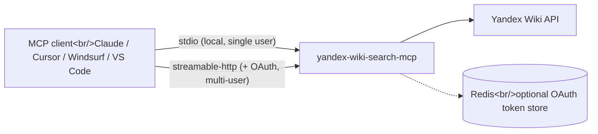

**English** | [Русский](README_ru.md)

<div align="center">


# Yandex Wiki Search MCP

[](https://glama.ai/mcp/servers/dlbolshov/yandex-wiki-search-mcp)
[](https://pypi.org/project/yandex-wiki-search-mcp/)
[](https://pypi.org/project/yandex-wiki-search-mcp/)
[](https://github.com/dlbolshov/yandex-wiki-search-mcp/actions/workflows/test.yml)
[](https://app.codecov.io/gh/dlbolshov/yandex-wiki-search-mcp)
[](LICENSE)
[](https://github.com/dlbolshov/yandex-wiki-search-mcp/pkgs/container/yandex-wiki-search-mcp)

</div>


Connect Claude, Cursor, Windsurf, or any MCP client to **Yandex Wiki**: full-text search,
pages, comments, attachments, and dynamic tables ("grids") — **33 tools** with typed schemas.

*An unofficial project — not affiliated with or endorsed by Yandex.*

- 🔍 **Full-text search** across the entire wiki — the same backend that powers the Wiki web search bar, up to 50 results per query
- 📄 **Full page lifecycle** — create, update, append (top / bottom / anchor), clone, delete with a recovery token, comments, file uploads
- 📊 **Dynamic tables (grids)** — 11 write tools: rows, columns, cells, copy, sort
- 🔒 **Server-side read-only mode** — `WIKI_READ_ONLY=true` simply doesn't register write tools, so the agent can't bypass it
- 🧩 **Typed tool surface** — every tool ships input *and* output JSON schemas plus safety annotations (read-only / destructive / idempotent hints)
- 🐳 **Runs anywhere** — stdio for desktop clients, streamable-http + Docker (with optional multi-user OAuth) for teams

## Quick start

1. Get a Yandex OAuth token with Wiki access ([official guide](https://yandex.ru/support/wiki/ru/api-ref/access)) and your organization ID.
2. Install into your client:

[](https://cursor.com/install-mcp?name=yandex-wiki-search&config=eyJjb21tYW5kIjoidXZ4IiwiYXJncyI6WyJ5YW5kZXgtd2lraS1zZWFyY2gtbWNwIl0sImVudiI6eyJXSUtJX1RPS0VOIjoiWU9VUl9UT0tFTiIsIldJS0lfT1JHX0lEIjoiWU9VUl9PUkdfSUQiLCJXSUtJX1JFQURfT05MWSI6InRydWUifX0=)
[](https://insiders.vscode.dev/redirect/mcp/install?name=yandex-wiki-search&config=%7B%22name%22%3A%22yandex-wiki-search%22%2C%22command%22%3A%22uvx%22%2C%22args%22%3A%5B%22yandex-wiki-search-mcp%22%5D%2C%22env%22%3A%7B%22WIKI_TOKEN%22%3A%22YOUR_TOKEN%22%2C%22WIKI_ORG_ID%22%3A%22YOUR_ORG_ID%22%2C%22WIKI_READ_ONLY%22%3A%22true%22%7D%7D)

<details>
<summary><b>Claude Desktop / Windsurf / any JSON-config client (uvx)</b></summary>

```json
{
  "mcpServers": {
    "yandex-wiki-search": {
      "command": "uvx",
      "args": ["yandex-wiki-search-mcp"],
      "env": {
        "WIKI_TOKEN": "YOUR_TOKEN",
        "WIKI_ORG_ID": "YOUR_ORG_ID",
        "WIKI_READ_ONLY": "true"
      }
    }
  }
}
```

</details>

<details>
<summary><b>Claude Code (CLI)</b></summary>

```bash
claude mcp add yandex-wiki-search \
  -e WIKI_TOKEN=YOUR_TOKEN -e WIKI_ORG_ID=YOUR_ORG_ID -e WIKI_READ_ONLY=true \
  -- uvx yandex-wiki-search-mcp
```

</details>

<details>
<summary><b>Docker (no Python required)</b></summary>

```json
{
  "mcpServers": {
    "yandex-wiki-search": {
      "command": "docker",
      "args": ["run","--rm","-i",
        "-e","WIKI_TOKEN","-e","WIKI_ORG_ID","-e","WIKI_READ_ONLY=true",
        "ghcr.io/dlbolshov/yandex-wiki-search-mcp:latest"],
      "env": {"WIKI_TOKEN":"YOUR_TOKEN","WIKI_ORG_ID":"YOUR_ORG_ID"}
    }
  }
}
```

</details>

> [!TIP]
> Start with `WIKI_READ_ONLY=true` — the server won't even register write tools.
> Flip it to `false` once you trust your agent with edits.

3. Ask your agent something — see below.

<details>
<summary><b>Need the old MCP SDK (1.x)?</b></summary>

The server runs on MCP Python SDK v2. That is invisible to clients — one v2 server
answers every protocol revision back to `2024-11-05` as well as the current one, so
there is nothing to change on your side and nothing to reinstall.

The only reason to hold back is a shared environment that pins `mcp<2` for something
else. `1.0.1` is the last release built on the 1.x SDK and stays on PyPI:

```bash
pip install "yandex-wiki-search-mcp<1.1"
```

</details>

## What can it do

> *"Find our onboarding docs and summarize the key steps."*
>
> *"What do we have on incident response? Open the most relevant page."*
>
> *"Create a page `team/weekly-notes` and append today's standup summary."*
>
> *"Add a row to the on-call rotation grid: alice, next week."*
>
> *"Upload this PDF to the project page and link it at the bottom."*
>
> *"Delete the draft page, but keep the recovery token in case I change my mind."*

## Tools

33 tools. All write tools disappear when `WIKI_READ_ONLY=true`.

### Search & read (10)

| Tool | What it does |
|---|---|
| `page_search` | Full-text search across the entire Wiki (pages and files), up to 50 ranked results with a text excerpt each; server-side filters and optional `<em>` match highlighting |
| `page_get` | Get a page by `page_id` or `slug` (accepts full Wiki URLs too) |
| `page_get_descendants` | Traverse a page subtree — one flat list of `{id, slug}` from all nesting levels; `from_root=true` walks the whole Wiki; `fetch_all` drains the cursor in one call |
| `page_get_comments` | List page comments (`fetch_all` supported) |
| `page_get_resources` | List page resources (attachments + grids) with server-side title search (`fetch_all` supported) |
| `page_get_attachments` | List page attachments (`fetch_all` supported) |
| `page_read_attachment` | Read an attachment's content straight into the conversation (nothing is saved anywhere) — images as a native image block that vision-capable clients render, text as text, small binaries as a base64 blob. Capped before transfer to protect the model's context window: 128 KiB for text/binary, 1 MiB for images; anything larger is refused with a pointer to `page_download_attachment` or `download_url` from `page_get_attachments` |
| `page_get_grids` | List grids attached to a page (`fetch_all` supported) |
| `grid_get` | Get a grid by `grid_id` with row/column/revision filters |
| `user_get_current` | Who am I — `username` and `home_cluster` (the caller's personal-section slug) |

### Pages: write (12)

| Tool | What it does |
|---|---|
| `page_create` | Create a page |
| `page_update` | Update page title and/or full content; set or clear a redirect to another page |
| `page_edit` | Edit content by exact-text replacements without resending the whole page; a missing or ambiguous match fails the call before anything is written; writes back with `allow_merge` so a concurrent edit is merged, not overwritten |
| `page_append_content` | Append content to top, bottom, or a named anchor |
| `page_clone` | Copy a page to a new slug — the copy gets a new id; children, comments, and history stay with the original; occupied slugs are refused. The API has no true move/rename ([details](docs/api-notes.md#pages)) |
| `page_add_comment` | Add a comment or reply in a thread |
| `page_delete_comment` | Delete a comment; returns the page's updated comment count |
| `page_delete_attachment` | Delete an attachment from a page |
| `page_delete` | Delete a page and receive a recovery token |
| `page_recover` | Recover a deleted page by recovery token |
| `page_upload_attachment` | Upload a local file in chunks and attach it to a page — not registered under `OAUTH_ENABLED=true`, where "local" would mean the shared server's filesystem |
| `page_download_attachment` | Download an attachment to a local file — streamed to disk with no size cap, nothing enters the conversation; refuses to overwrite unless asked. Gated the same way as `page_upload_attachment` under OAuth |

### Grids: write (11)

<details>
<summary>Expand the table</summary>

| Tool | What it does |
|---|---|
| `grid_create` | Create a grid on a page |
| `grid_update` | Update grid title and/or default sort |
| `grid_copy` | Copy a grid to an existing target page (async operation) |
| `grid_delete` | Delete a grid |
| `grid_add_rows` | Add rows at a position or after a given row |
| `grid_update_cells` | Update individual cells by row + column |
| `grid_delete_rows` | Delete rows |
| `grid_move_row` | Move a row |
| `grid_add_columns` | Add typed columns |
| `grid_delete_columns` | Delete columns by slug |
| `grid_move_column` | Move a column |

Grid specifics:

- Mutations use optimistic locking — fetch the grid first and pass the latest `revision`.
- `grid_update.default_sort` takes `[{"column": "status", "direction": "asc"}]` entries; the server converts them to the wire format the API expects.
- `grid_add_columns` requires `required` on every column because the real API validates it.
- `grid_copy` returns operation metadata, not a ready copied grid object.

</details>

## How it compares

Facts verified against the alternatives' docs and published code, July–August 2026;
the official hosted server's tool list captured live from `mcp.wiki.yandex.net`
(`wiki-mcp-server` 1.28.1, 2026-08-11).

| | **yandex-wiki-search-mcp** | [Yandex's official MCP](https://yandex.ru/support/wiki/en/mcp) (hosted) | [ya-yandex-wiki-mcp](https://github.com/APonkratov/yandex-wiki-mcp) | [slartus/mcp-yandex-wiki](https://github.com/slartus/mcp-yandex-wiki) | [ya-wiki-mcp](https://pypi.org/project/ya-wiki-mcp/) |
|---|---|---|---|---|---|
| Full-text search | ✅ up to 50 results, server-side filters + highlighting | ❌ no search tool | ❌ | ✅ up to 10 results | ❌ |
| Pages: create / update / append / delete + recover | ✅ all, plus partial edits via text replacement (`page_edit`) | partial — no append / recover; has partial edits via text replacement | ✅ all | partial — no append / recover | partial — no recover |
| Pages: clone to a new slug | ✅ `page_clone` | ❌ | ❌ | ❌ | ✅ |
| Grids: write tools | ✅ 11 | ✅ 12, incl. column update + row pin/color | ✅ 11 | ❌ read-only | ✅ 11, incl. clone |
| Comments, attachment upload | ✅ incl. deletion, inline image preview, and download to disk | comments ✅ / upload ❌ (download + preview instead) | ✅ | ❌ | ❌ |
| Server-side read-only mode | ✅ | ❌ | ✅ | ❌ | ❌ |
| Typed output schemas + tool annotations | ✅ | ❌ | ❌ | ❌ | ❌ tools return plain strings |
| YFM helpers | ✅ syntax cheat sheet resource + `yfm_warnings` in write tools | ❌ | ❌ | ❌ | ✅ Markdown→YFM converter + page-tree cache, prompt templates |
| Docker / PyPI / MCP Registry | ✅ / ✅ / ✅ | — hosted service, closed source, nothing to install | ✅ / ✅ / ✅ | ❌ manual install | PyPI only; no source repo linked |
| Multi-user OAuth for HTTP deployments | ✅ | ❌ per-user token pasted into static headers, no OAuth flow | ✅ | ❌ | ❌ |

Also worth knowing:

- [best-doctor/mcp-yandex-wiki](https://github.com/best-doctor/mcp-yandex-wiki) (Python) — page create / update plus reads, with a separate `-ro` read-only entry point; no delete / recover, no grids, no search; PyPI only
- [brekhov-ilya/yandex-wiki-mcp](https://github.com/brekhov-ilya/yandex-wiki-mcp) (npm) — pages read / write / move, grids read-only; interactive PKCE token flow with auto-refresh, no full-text search
- [n-r-w/yandex-mcp](https://github.com/n-r-w/yandex-mcp) (Go) — Yandex Tracker + Wiki in one server, read-only by design (5 wiki read tools), no search; auth via IAM tokens from the `yc` CLI only — Yandex OAuth tokens are not supported

As of August 2026, full-text search exists only here (up to 50 results) and in slartus
(up to 10) — Yandex's own hosted server ships without a search tool — and the
combination of search, grid writes, server-side read-only mode, and typed schemas is
unique to this project.

This project is a fork of `ya-yandex-wiki-mcp` and builds on findings from
`slartus/mcp-yandex-wiki` — see [Credits](#credits).

## Full-text search

`page_search` wraps the `POST /v1/search` endpoint — the same backend that powers the
Wiki web search bar, undocumented until Yandex published its
[API reference](https://yandex.ru/support/wiki/ru/api-ref/search/search__search) in
August 2026. Search first, then open a result with `page_get` by its `slug`.

- Up to **50** results per call (`limit` is clamped to 1–50; the API rejects anything else).
- **Filters run server-side, before the limit** — a filtered search does not lose matches to it: `slug_prefix` (section filter, deep prefixes like `tech-doc/ml` are fine), `result_type` (`page`/`file`), `authors` (page owners by `uid`/`cloud_uid` — `user_get_current` supplies your own, turning "find my pages about X" into two calls), and `created_between`/`modified_between` date intervals (both bounds required — the API rejects open ones).
- Quoted `"exact phrase"` queries work; `page` results get absolute `https://wiki.yandex.ru/...` links, `file` results get direct download links.
- `content` is a **~510-character excerpt, not the page and not a summary**: it is cut from wherever the match sits, the query terms need not be inside it, and its line breaks and tabs are the page's own layout (table cells arrive tab-separated) rather than separators between fragments. Pass `highlight=true` to get matches wrapped in `<em>` tags. Read the page with `page_get` before answering from it. Empty for `file` results.

## Traversing the tree

`page_get_descendants` returns a subtree as one flat list of `{id, slug}` from every
nesting level. Passing `from_root=true` instead of `page_id`/`slug` walks the **whole
Wiki** — the way in when no starting slug is known, so search is not the only entry
point. Prefer a section slug when you have one: wikis run to thousands of pages, and
`fetch_all` stops at its ~500-item cap with `truncated: true`.

More verified API behavior (scopes, 403 semantics, error envelopes, limits): [docs/api-notes.md](docs/api-notes.md).

## Configuration

| Variable | Required | Default | Description |
|---|---|---|---|
| `WIKI_TOKEN` | one of the two | — | Yandex OAuth token (takes precedence when both are set) |
| `WIKI_IAM_TOKEN` | | — | IAM token (Yandex Cloud organizations) |
| `WIKI_ORG_ID` | exactly one of the two | — | Yandex 360 organization ID (`X-Org-Id`) |
| `WIKI_CLOUD_ORG_ID` | | — | Yandex Cloud organization ID (`X-Cloud-Org-Id`) |
| `WIKI_READ_ONLY` | no | `false` | `true` disables all write tools server-side |
| `TRANSPORT` | no | `stdio` | `stdio` \| `sse` \| `streamable-http` |
| `HOST` / `PORT` | no | `0.0.0.0` / `8000` | HTTP transports only |
| `STATELESS_HTTP` / `JSON_RESPONSE` | no | `true` / `true` | `streamable-http` only: keep no per-session state / answer with JSON instead of SSE |
| `LOG_LEVEL` | no | `INFO` | Logs go to stderr; `DEBUG` additionally logs Wiki API requests (method, path, status, duration — never headers or bodies) |
| `WIKI_API_BASE_URL` | no | `https://api.wiki.yandex.net` | Wiki API endpoint |
| `WIKI_WEB_BASE_URL` | no | `https://wiki.yandex.ru` | Base for absolute page links in `page_search` results |
| `WIKI_AUTH_SCHEME` | no | `OAuth` | `Authorization` header scheme for `WIKI_TOKEN` (`OAuth` \| `Bearer`) |
| `WIKI_MAX_RETRIES` | no | `2` | Retries for dropped connections and `429`/`502`/`503`/`504` on read requests; `0` disables them |
| `TOOL_RESULT_TEXT` | no | `pretty` | Text duplicate of structured tool results: `pretty` (indent=2) \| `compact` (single line, 10-30% off the text block) \| `none` (structured only — check your client renders `structuredContent` first) |

<details>
<summary><b>Multi-user OAuth + Redis (HTTP deployments only)</b></summary>

With `OAUTH_ENABLED=true` the server becomes an OAuth provider: each MCP user
authorizes with their own Yandex account, and requests to the Wiki API are made with
their personal token. `page_upload_attachment` and `page_download_attachment` are
not registered in this mode: they read and write files on the machine the server
runs on, which is not the caller's machine in a shared deployment.

| Variable | Default | Description |
|---|---|---|
| `OAUTH_ENABLED` | `false` | Enable the OAuth provider |
| `OAUTH_STORE` | `memory` | `memory` \| `redis` |
| `OAUTH_SERVER_URL` | `https://oauth.yandex.ru` | Yandex OAuth server |
| `OAUTH_USE_SCOPES` | `true` | Request Wiki scopes during authorization |
| `OAUTH_CLIENT_ID` / `OAUTH_CLIENT_SECRET` | — | Your Yandex OAuth app credentials |
| `OAUTH_CLIENT_SECRET_EXPIRY_SECONDS` | `2592000` (30 days) | Lifetime of a dynamically registered MCP client. Registration is unauthenticated by protocol design, so without an expiry every registration is kept forever; clients are told the deadline at registration and re-register when it passes. Empty disables it |
| `MCP_SERVER_PUBLIC_URL` | — | Public URL of this server (OAuth callbacks) |
| `OAUTH_ENCRYPTION_KEYS` | — | Comma-separated base64 32-byte keys (required for `redis` store) |
| `REDIS_ENDPOINT` / `REDIS_PORT` / `REDIS_DB` / `REDIS_PASSWORD` / `REDIS_POOL_MAX_SIZE` | `localhost` / `6379` / `0` / — / `10` | Redis connection |

**Choosing the organization per user.** `WIKI_ORG_ID` / `WIKI_CLOUD_ORG_ID` are optional
under OAuth, because each request can name its own organization: append `?orgId=...` (or
`?cloudOrgId=...`) to the MCP server URL your client connects to. A query parameter wins
over the server-wide setting, so one deployment can serve several organizations. If a
request carries neither, the tool call fails with a message pointing at both options —
set the environment variable as the default if all your users share one organization.

See [`.env.example`](.env.example) for the full annotated list and [`compose.yaml`](compose.yaml) for a Redis baseline.

</details>

## Deployment


```mermaid
flowchart LR
    C["MCP client&lt;br/&gt;Claude / Cursor / Windsurf / VS Code"]
    S["yandex-wiki-search-mcp"]
    W["Yandex Wiki API"]
    R[("Redis&lt;br/&gt;optional OAuth token store")]
    C -- "stdio (local, single user)" --> S
    C -- "streamable-http (+ OAuth, multi-user)" --> S
    S --> W
    S -.-> R
```

**HTTP server via Docker** (the MCP endpoint is `http://localhost:8000/mcp`):

```bash
docker run --env-file .env -e TRANSPORT=streamable-http -p 8000:8000 \
  --log-opt max-size=10m --log-opt max-file=3 \
  ghcr.io/dlbolshov/yandex-wiki-search-mcp:latest
```

> [!NOTE]
> The server writes no log files of its own — everything goes to stderr, which
> Docker's default `json-file` driver stores **without a size limit**. The
> `--log-opt` flags above cap it; drop them only if your daemon already sets a
> default.

<details>
<summary><b>Docker Compose</b></summary>

```yaml
services:
  mcp-wiki:
    image: ghcr.io/dlbolshov/yandex-wiki-search-mcp:latest  # or: build: .
    ports:
      - "8000:8000"
    environment:
      - WIKI_TOKEN=${WIKI_TOKEN}
      - WIKI_ORG_ID=${WIKI_ORG_ID}
      - TRANSPORT=streamable-http
    logging:
      driver: json-file
      options:
        max-size: "10m"
        max-file: "3"
```

For Redis-backed OAuth storage, use the existing [`compose.yaml`](compose.yaml) as the baseline.

</details>

## Security

- **Read-only is server-side**: with `WIKI_READ_ONLY=true` write tools are never registered — there is nothing for a confused agent to call.
- **Wiki API does not enforce OAuth scopes** (re-verified 2026-08-11, after Yandex documented the scopes — see [docs/api-notes.md](docs/api-notes.md)): a `wiki:read` token can still write, so use the read-only mode rather than relying on token scopes.
- Secrets are `SecretStr` throughout — masked in logs and `repr`; `DEBUG` HTTP logging never includes headers or bodies.
- Deletion is recoverable: `page_delete` returns a recovery token for `page_recover`.
- Unrelated keys in a shared `.env` are ignored, but a misspelled setting (`WIKI_READ_ONL`) stops the server instead of silently falling back to a default you did not choose.

## Development

```bash
uv sync --dev
uv run yandex-wiki-search-mcp   # run locally
uv run pytest                   # tests
```

Before committing, run the full verification set from [CONTRIBUTING.md](CONTRIBUTING.md).
How the server is put together — the layers, the code map, testing seams, CI and the
release process — is described in [docs/architecture.md](docs/architecture.md).
Verified API behavior and probe scripts are documented in [docs/api-notes.md](docs/api-notes.md).

The Wiki API drifts (the search endpoint silently changed contract once already, back
when it was undocumented) — `scripts/contract_sweep.py` re-verifies every client method
against a live organization and reports validation mismatches and undeclared keys:

```bash
uv run python scripts/contract_sweep.py users/YOU/contract-sweep            # ~30 live checks
uv run python scripts/contract_sweep.py users/YOU/contract-sweep --cleanup  # remove fixtures
```

The [API drift check](.github/workflows/api-drift.yml) workflow runs the same sweep
weekly when the `DRIFT_*` repository secrets are configured
(instructions in the workflow header); without them it skips quietly.

## Credits

This project began as a fork of [APonkratov/yandex-wiki-mcp](https://github.com/APonkratov/yandex-wiki-mcp)
(`ya-yandex-wiki-mcp`) by Aleksandr Ponkratov, an excellent, well-tested Python MCP server
for the Yandex Wiki API, licensed under Apache-2.0. It has since grown its own surface —
full-text search, typed input *and* output schemas across all 33 tools, YFM helpers,
cursor draining, multi-user OAuth and a live contract sweep against the API — while the
original copyright and license are preserved (see [LICENSE](LICENSE) and [NOTICE](NOTICE)).

The idea and key API findings behind full-text search come from
[slartus/mcp-yandex-wiki](https://github.com/slartus/mcp-yandex-wiki) (JavaScript, MIT):
it was the first to discover the then-undocumented `POST /v1/search` endpoint (Yandex
published a reference for it only in August 2026) and to report that OAuth scopes are
not enforced. No code was taken from it — only findings and ideas, independently
re-verified against a live organization and extended here.

## Trademarks

"Yandex" and "Yandex Wiki" are trademarks of YANDEX LLC. This is an unofficial,
community-built project: not affiliated with, sponsored, or endorsed by Yandex — the
names are used nominatively, to state which service the server talks to. The logo is
an original mark that reproduces neither Yandex Wiki nor MCP branding
([design notes](docs/assets/logo/README.md)).

---

`mcp-name: io.github.dlbolshov/yandex-wiki-search-mcp`
