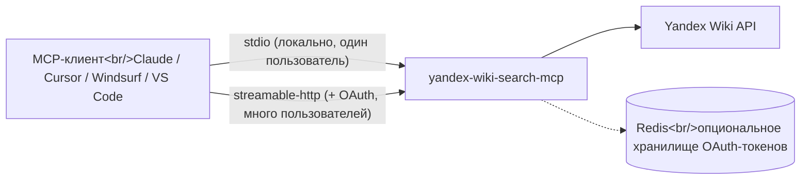

[English](README.md) | **Русский**

# Yandex Wiki Search MCP

[](https://glama.ai/mcp/servers/dlbolshov/yandex-wiki-search-mcp)
[](https://pypi.org/project/yandex-wiki-search-mcp/)
[](https://pypi.org/project/yandex-wiki-search-mcp/)
[](https://github.com/dlbolshov/yandex-wiki-search-mcp/actions/workflows/test.yml)
[](https://app.codecov.io/gh/dlbolshov/yandex-wiki-search-mcp)
[](LICENSE)
[](https://github.com/dlbolshov/yandex-wiki-search-mcp/pkgs/container/yandex-wiki-search-mcp)


Подключите Claude, Cursor, Windsurf или любой MCP-клиент к **Яндекс Вики**: полнотекстовый
поиск, страницы, комментарии, вложения и динамические таблицы («гриды») — **27 тулзов**
с типизированными схемами.

- 🔍 **Полнотекстовый поиск** по всей вики — тот же бэкенд, что у строки поиска в веб-интерфейсе, до 50 результатов за запрос
- 📄 **Полный цикл работы со страницами** — создание, обновление, дозапись (верх / низ / якорь), клонирование, удаление с токеном восстановления, комментарии, загрузка файлов
- 📊 **Динамические таблицы (гриды)** — 11 write-тулзов: строки, колонки, ячейки, копирование, сортировка
- 🔒 **Серверный read-only режим** — при `WIKI_READ_ONLY=true` write-тулзы просто не регистрируются, агент не сможет их вызвать
- 🧩 **Типизированные тулзы** — у каждого есть JSON-схемы входа *и* выхода плюс аннотации безопасности (read-only / destructive / idempotent)
- 🐳 **Работает где угодно** — stdio для десктопных клиентов, streamable-http + Docker (с опциональным многопользовательским OAuth) для команд

## Быстрый старт

1. Получите OAuth-токен Яндекса с доступом к Вики ([официальная инструкция](https://yandex.ru/support/wiki/ru/api-ref/access)) и ID организации.
2. Установите в свой клиент:

[](https://cursor.com/install-mcp?name=yandex-wiki-search&config=eyJjb21tYW5kIjoidXZ4IiwiYXJncyI6WyJ5YW5kZXgtd2lraS1zZWFyY2gtbWNwIl0sImVudiI6eyJXSUtJX1RPS0VOIjoiWU9VUl9UT0tFTiIsIldJS0lfT1JHX0lEIjoiWU9VUl9PUkdfSUQiLCJXSUtJX1JFQURfT05MWSI6InRydWUifX0=)
[](https://insiders.vscode.dev/redirect/mcp/install?name=yandex-wiki-search&config=%7B%22name%22%3A%22yandex-wiki-search%22%2C%22command%22%3A%22uvx%22%2C%22args%22%3A%5B%22yandex-wiki-search-mcp%22%5D%2C%22env%22%3A%7B%22WIKI_TOKEN%22%3A%22YOUR_TOKEN%22%2C%22WIKI_ORG_ID%22%3A%22YOUR_ORG_ID%22%2C%22WIKI_READ_ONLY%22%3A%22true%22%7D%7D)

<details>
<summary><b>Claude Desktop / Windsurf / любой клиент с JSON-конфигом (uvx)</b></summary>

```json
{
  "mcpServers": {
    "yandex-wiki-search": {
      "command": "uvx",
      "args": ["yandex-wiki-search-mcp"],
      "env": {
        "WIKI_TOKEN": "YOUR_TOKEN",
        "WIKI_ORG_ID": "YOUR_ORG_ID",
        "WIKI_READ_ONLY": "true"
      }
    }
  }
}
```

</details>

<details>
<summary><b>Claude Code (CLI)</b></summary>

```bash
claude mcp add yandex-wiki-search \
  -e WIKI_TOKEN=YOUR_TOKEN -e WIKI_ORG_ID=YOUR_ORG_ID -e WIKI_READ_ONLY=true \
  -- uvx yandex-wiki-search-mcp
```

</details>

<details>
<summary><b>Docker (Python не нужен)</b></summary>

```json
{
  "mcpServers": {
    "yandex-wiki-search": {
      "command": "docker",
      "args": ["run","--rm","-i",
        "-e","WIKI_TOKEN","-e","WIKI_ORG_ID","-e","WIKI_READ_ONLY=true",
        "ghcr.io/dlbolshov/yandex-wiki-search-mcp:latest"],
      "env": {"WIKI_TOKEN":"YOUR_TOKEN","WIKI_ORG_ID":"YOUR_ORG_ID"}
    }
  }
}
```

</details>

> [!TIP]
> Начните с `WIKI_READ_ONLY=true` — сервер даже не зарегистрирует write-тулзы.
> Переключите в `false`, когда будете доверять агенту правки.

3. Спросите агента — примеры ниже.

<details>
<summary><b>Нужен старый MCP SDK (1.x)?</b></summary>

Сервер работает на MCP Python SDK v2. Для клиентов это незаметно: один v2-сервер
отвечает на все ревизии протокола начиная с `2024-11-05` и на текущую, так что менять
у себя ничего не нужно и переустанавливать тоже.

Единственная причина держаться за старый SDK — общее окружение, где `mcp<2` запинен
чем-то другим. `1.0.1` — последний релиз на SDK 1.x, он остаётся на PyPI:

```bash
pip install "yandex-wiki-search-mcp<1.1"
```

</details>

## Что он умеет

> *«Найди наши доки по онбордингу и суммаризируй ключевые шаги»*
>
> *«Что у нас есть про incident response? Открой самую релевантную страницу»*
>
> *«Создай страницу `team/weekly-notes` и допиши туда итоги сегодняшнего стендапа»*
>
> *«Добавь строку в таблицу дежурств: alice, следующая неделя»*
>
> *«Залей этот PDF на страницу проекта и поставь ссылку внизу»*
>
> *«Удали черновик, но сохрани токен восстановления — вдруг передумаю»*

## Тулзы

27 тулзов. Все write-тулзы исчезают при `WIKI_READ_ONLY=true`.

### Поиск и чтение (8)

| Тулза | Что делает |
|---|---|
| `page_search` | Полнотекстовый поиск по всей Вики (страницы и файлы), до 50 ранжированных результатов, у каждого — фрагмент текста |
| `page_get` | Страница по `page_id` или `slug` (полные URL Вики тоже принимаются) |
| `page_get_descendants` | Обход поддерева — плоский список `{id, slug}` со всех уровней вложенности; `from_root=true` обходит всю Вики; `fetch_all` вычерпывает курсор за один вызов |
| `page_get_comments` | Комментарии страницы (поддерживается `fetch_all`) |
| `page_get_resources` | Ресурсы страницы (вложения + гриды) с серверным поиском по названию (поддерживается `fetch_all`) |
| `page_get_attachments` | Вложения страницы (поддерживается `fetch_all`) |
| `page_get_grids` | Гриды, прикреплённые к странице (поддерживается `fetch_all`) |
| `grid_get` | Грид по `grid_id` с фильтрами строк/колонок/ревизий |

### Страницы: запись (8)

| Тулза | Что делает |
|---|---|
| `page_create` | Создать страницу |
| `page_update` | Обновить заголовок и/или полное содержимое |
| `page_append_content` | Дописать контент в начало, конец или к именованному якорю |
| `page_clone` | Скопировать страницу на новый slug — у копии новый id; дети, комментарии и история остаются у оригинала; занятый slug — отказ. Настоящего move/rename в API нет ([подробности](docs/api-notes_ru.md#страницы)) |
| `page_add_comment` | Добавить комментарий или ответ в тред |
| `page_delete` | Удалить страницу и получить токен восстановления |
| `page_recover` | Восстановить удалённую страницу по токену |
| `page_upload_attachment` | Загрузить локальный файл по частям и прикрепить к странице — не регистрируется при `OAUTH_ENABLED=true`, где «локальный» означал бы файловую систему общего сервера |

### Гриды: запись (11)

<details>
<summary>Развернуть таблицу</summary>

| Тулза | Что делает |
|---|---|
| `grid_create` | Создать грид на странице |
| `grid_update` | Обновить заголовок и/или сортировку по умолчанию |
| `grid_copy` | Скопировать грид на существующую страницу (асинхронная операция) |
| `grid_delete` | Удалить грид |
| `grid_add_rows` | Добавить строки на позицию или после указанной строки |
| `grid_update_cells` | Обновить отдельные ячейки по строке + колонке |
| `grid_delete_rows` | Удалить строки |
| `grid_move_row` | Переместить строку |
| `grid_add_columns` | Добавить типизированные колонки |
| `grid_delete_columns` | Удалить колонки по slug |
| `grid_move_column` | Переместить колонку |

Особенности гридов:

- Мутации используют optimistic locking — сначала получите грид и передайте актуальную `revision`.
- `grid_update.default_sort` принимает записи вида `[{"column": "status", "direction": "asc"}]`; сервер сам конвертирует их в формат, который ожидает API.
- `grid_add_columns` требует `required` у каждой колонки — реальный API это валидирует.
- `grid_copy` возвращает метаданные операции, а не готовую копию грида.

</details>

## Сравнение с аналогами

Факты сверены с документацией и опубликованным кодом альтернатив, июль–август 2026.

| | **yandex-wiki-search-mcp** | [ya-yandex-wiki-mcp](https://github.com/APonkratov/yandex-wiki-mcp) | [slartus/mcp-yandex-wiki](https://github.com/slartus/mcp-yandex-wiki) | [best-doctor/mcp-yandex-wiki](https://github.com/best-doctor/mcp-yandex-wiki) | [ya-wiki-mcp](https://pypi.org/project/ya-wiki-mcp/) |
|---|---|---|---|---|---|
| Полнотекстовый поиск | ✅ до 50 результатов, клиентские фильтры | ❌ | ✅ до 10 результатов | ❌ | ❌ |
| Страницы: create / update / append / delete + recover | ✅ всё | ✅ всё | частично — нет append / recover | частично — нет delete / recover | частично — нет recover |
| Страницы: клонирование на новый slug | ✅ `page_clone` | ❌ | ❌ | ❌ | ✅ |
| Гриды: write-тулзы | ✅ 11 | ✅ 11 | ❌ только чтение | ❌ гридов нет | ✅ 11, вкл. clone |
| Комментарии, загрузка вложений | ✅ | ✅ | ❌ | ❌ | ❌ |
| Серверный read-only режим | ✅ | ✅ | ❌ | ✅ отдельный `-ro` вариант запуска | ❌ |
| Типизированные output-схемы + аннотации | ✅ | ❌ | ❌ | ❌ | ❌ тулзы возвращают голые строки |
| YFM-хелперы | ✅ ресурс со шпаргалкой по синтаксису + `yfm_warnings` в write-тулзах | ❌ | ❌ | ❌ | ✅ конвертер Markdown→YFM + кэш дерева страниц, prompt-шаблоны |
| Docker / PyPI / MCP Registry | ✅ / ✅ / ✅ | ✅ / ✅ / ✅ | ❌ ручная установка | только PyPI | только PyPI; репозиторий исходников не указан |
| Многопользовательский OAuth для HTTP | ✅ | ✅ | ❌ | ❌ | ❌ |

Ещё стоит знать:

- [brekhov-ilya/yandex-wiki-mcp](https://github.com/brekhov-ilya/yandex-wiki-mcp) (npm) — страницы read / write / move, гриды только на чтение; интерактивное получение токена через PKCE с автообновлением, без поиска
- [n-r-w/yandex-mcp](https://github.com/n-r-w/yandex-mcp) (Go) — Yandex Tracker + Wiki в одном сервере, принципиально только чтение (5 wiki-тулзов), без поиска; авторизация только IAM-токенами через `yc` CLI — OAuth-токены Яндекса не поддерживаются

На июль 2026 полнотекстовый поиск есть только здесь (до 50 результатов) и у slartus (до 10);
сочетание поиска, записи в гриды, серверного read-only и типизированных схем —
уникально для этого проекта.

Проект — форк `ya-yandex-wiki-mcp`, поиск построен на находках `slartus/mcp-yandex-wiki` —
см. [Благодарности](#благодарности).

## Полнотекстовый поиск

`page_search` оборачивает недокументированный, но публичный эндпоинт `POST /v1/search` —
тот же бэкенд, что у строки поиска в веб-интерфейсе Вики. Сначала ищите, потом открывайте
результат через `page_get` по его `slug`.

- До **50** результатов за вызов (`limit` ограничивается 1–50; остальное API отклоняет).
- Поиск **только глобальный** — фильтры `slug_prefix` и `result_type` применяются на клиенте после получения, поэтому сочетайте их с `limit=50`, чтобы не терять совпадения.
- Запросы `"в кавычках"` дают фразовый поиск; результаты-`page` получают абсолютные ссылки `https://wiki.yandex.ru/...`, результаты-`file` — прямые ссылки на скачивание.
- `content` — это **фрагмент ~510 знаков, не страница и не выжимка**: он вырезан по месту совпадения, ничего не подсвечено, слов запроса внутри может не быть, а переводы строк и табы — собственная разметка страницы (ячейки таблиц приходят через табы), а не разделители между кусками. Прежде чем отвечать по нему, прочитайте страницу через `page_get`. У результатов-`file` поле пустое.

## Обход дерева

`page_get_descendants` возвращает поддерево одним плоским списком `{id, slug}` со всех
уровней вложенности. Если вместо `page_id`/`slug` передать `from_root=true`, обход
охватит **всю Вики** — это способ войти, когда стартовый слаг неизвестен, так что поиск
не единственная точка входа. Когда слаг раздела известен, лучше использовать его: в вики
обычно тысячи страниц, а `fetch_all` упирается в предел ~500 элементов и отдаёт
`truncated: true`.

Больше проверенного поведения API (скоупы, семантика 403, форматы ошибок, лимиты):
[docs/api-notes_ru.md](docs/api-notes_ru.md).

## Конфигурация

| Переменная | Обязательна | По умолчанию | Описание |
|---|---|---|---|
| `WIKI_TOKEN` | одна из двух | — | OAuth-токен Яндекса (приоритетнее, если заданы оба) |
| `WIKI_IAM_TOKEN` | | — | IAM-токен (организации Yandex Cloud) |
| `WIKI_ORG_ID` | ровно одна из двух | — | ID организации Яндекс 360 (`X-Org-Id`) |
| `WIKI_CLOUD_ORG_ID` | | — | ID организации Yandex Cloud (`X-Cloud-Org-Id`) |
| `WIKI_READ_ONLY` | нет | `false` | `true` отключает все write-тулзы на сервере |
| `TRANSPORT` | нет | `stdio` | `stdio` \| `sse` \| `streamable-http` |
| `HOST` / `PORT` | нет | `0.0.0.0` / `8000` | Только для HTTP-транспортов |
| `STATELESS_HTTP` / `JSON_RESPONSE` | нет | `true` / `true` | Только для `streamable-http`: не хранить состояние сессии / отвечать JSON вместо SSE |
| `LOG_LEVEL` | нет | `INFO` | Логи в stderr; `DEBUG` дополнительно логирует запросы к API (метод, путь, статус, длительность — без заголовков и тел) |
| `WIKI_API_BASE_URL` | нет | `https://api.wiki.yandex.net` | Эндпоинт Wiki API |
| `WIKI_WEB_BASE_URL` | нет | `https://wiki.yandex.ru` | База для абсолютных ссылок в результатах `page_search` |
| `WIKI_AUTH_SCHEME` | нет | `OAuth` | Схема заголовка `Authorization` для `WIKI_TOKEN` (`OAuth` \| `Bearer`) |
| `WIKI_MAX_RETRIES` | нет | `2` | Ретраи на обрыв соединения и `429`/`502`/`503`/`504` для читающих запросов; `0` выключает |
| `TOOL_RESULT_TEXT` | нет | `pretty` | Текстовый дубль structured-результатов тулзов: `pretty` (indent=2) \| `compact` (одна строка, на 10–30% меньше текстового блока) \| `none` (только structured — сначала проверьте, что ваш клиент показывает `structuredContent`) |

<details>
<summary><b>Многопользовательский OAuth + Redis (только HTTP-деплой)</b></summary>

При `OAUTH_ENABLED=true` сервер становится OAuth-провайдером: каждый пользователь MCP
авторизуется своим аккаунтом Яндекса, и запросы к Wiki API идут с его личным токеном.
В этом режиме `page_upload_attachment` не регистрируется: он читает файлы с машины,
где запущен сервер, а в общем деплое это не машина вызывающего.

| Переменная | По умолчанию | Описание |
|---|---|---|
| `OAUTH_ENABLED` | `false` | Включить OAuth-провайдер |
| `OAUTH_STORE` | `memory` | `memory` \| `redis` |
| `OAUTH_SERVER_URL` | `https://oauth.yandex.ru` | OAuth-сервер Яндекса |
| `OAUTH_USE_SCOPES` | `true` | Запрашивать Wiki-скоупы при авторизации |
| `OAUTH_CLIENT_ID` / `OAUTH_CLIENT_SECRET` | — | Данные вашего OAuth-приложения Яндекса |
| `OAUTH_CLIENT_SECRET_EXPIRY_SECONDS` | `2592000` (30 дней) | Срок жизни динамически зарегистрированного MCP-клиента. Регистрация по протоколу не требует аутентификации, поэтому без срока каждая регистрация хранится вечно; клиент узнаёт дедлайн при регистрации и перерегистрируется, когда тот истечёт. Пусто — отключить |
| `MCP_SERVER_PUBLIC_URL` | — | Публичный URL этого сервера (OAuth-коллбэки) |
| `OAUTH_ENCRYPTION_KEYS` | — | base64-ключи по 32 байта через запятую (обязательно для `redis`) |
| `REDIS_ENDPOINT` / `REDIS_PORT` / `REDIS_DB` / `REDIS_PASSWORD` / `REDIS_POOL_MAX_SIZE` | `localhost` / `6379` / `0` / — / `10` | Подключение к Redis |

**Выбор организации для каждого пользователя.** Под OAuth `WIKI_ORG_ID` /
`WIKI_CLOUD_ORG_ID` необязательны: организацию можно назвать в каждом запросе — добавьте
`?orgId=...` (или `?cloudOrgId=...`) к URL MCP-сервера, к которому подключается клиент.
Query-параметр важнее общесерверной настройки, поэтому один деплой может обслуживать
несколько организаций. Если в запросе нет ни того, ни другого, вызов тулзы завершится
ошибкой с подсказкой про оба способа — задайте переменную окружения как значение по
умолчанию, если все ваши пользователи в одной организации.

Полный аннотированный список — в [`.env.example`](.env.example), база для Redis — в [`compose.yaml`](compose.yaml).

</details>

## Деплой


```mermaid
flowchart LR
    C["MCP-клиент&lt;br/&gt;Claude / Cursor / Windsurf / VS Code"]
    S["yandex-wiki-search-mcp"]
    W["Yandex Wiki API"]
    R[("Redis&lt;br/&gt;опциональное хранилище OAuth-токенов")]
    C -- "stdio (локально, один пользователь)" --> S
    C -- "streamable-http (+ OAuth, много пользователей)" --> S
    S --> W
    S -.-> R
```

**HTTP-сервер через Docker** (MCP-эндпоинт — `http://localhost:8000/mcp`):

```bash
docker run --env-file .env -e TRANSPORT=streamable-http -p 8000:8000 \
  --log-opt max-size=10m --log-opt max-file=3 \
  ghcr.io/dlbolshov/yandex-wiki-search-mcp:latest
```

> [!NOTE]
> Сервер не пишет собственных лог-файлов — всё уходит в stderr, а драйвер
> Docker `json-file` по умолчанию хранит его **без ограничения размера**. Флаги
> `--log-opt` выше это ограничивают; убирайте их, только если лимит уже задан
> на уровне демона.

<details>
<summary><b>Docker Compose</b></summary>

```yaml
services:
  mcp-wiki:
    image: ghcr.io/dlbolshov/yandex-wiki-search-mcp:latest  # или: build: .
    ports:
      - "8000:8000"
    environment:
      - WIKI_TOKEN=${WIKI_TOKEN}
      - WIKI_ORG_ID=${WIKI_ORG_ID}
      - TRANSPORT=streamable-http
    logging:
      driver: json-file
      options:
        max-size: "10m"
        max-file: "3"
```

Для OAuth-хранилища на Redis используйте существующий [`compose.yaml`](compose.yaml) как базу.

</details>

## Безопасность

- **Read-only работает на сервере**: при `WIKI_READ_ONLY=true` write-тулзы не регистрируются — запутавшемуся агенту просто нечего вызывать.
- **Wiki API не проверяет OAuth-скоупы** (проверено живьём — см. [docs/api-notes_ru.md](docs/api-notes_ru.md)): токен с `wiki:read` может писать, поэтому полагайтесь на read-only режим, а не на скоупы.
- Секреты — `SecretStr` по всему коду: замаскированы в логах и `repr`; `DEBUG`-логирование HTTP никогда не пишет заголовки и тела.
- Удаление обратимо: `page_delete` возвращает токен восстановления для `page_recover`.
- Посторонние ключи в общем `.env` игнорируются, но опечатка в названии настройки (`WIKI_READ_ONL`) останавливает сервер, а не откатывает его молча на значение по умолчанию, которое вы не выбирали.

## Разработка

```bash
uv sync --dev
uv run yandex-wiki-search-mcp   # локальный запуск
uv run pytest                   # тесты
```

Перед коммитом прогоните полный набор проверок из [CONTRIBUTING.md](CONTRIBUTING.md).
Как сервер устроен — слои, карта кода, швы тестирования, CI и процесс релиза —
описано в [docs/architecture_ru.md](docs/architecture_ru.md).
Проверенное поведение API и probe-скрипты описаны в [docs/api-notes_ru.md](docs/api-notes_ru.md).

Вики-API дрейфует (недокументированный эндпоинт поиска уже однажды молча сменил
контракт) — `scripts/contract_sweep.py` перепроверяет каждый метод клиента на живой
организации и репортит расхождения валидации и необъявленные ключи:

```bash
uv run python scripts/contract_sweep.py users/YOU/contract-sweep            # ~30 живых проверок
uv run python scripts/contract_sweep.py users/YOU/contract-sweep --cleanup  # убрать фикстуры
```

Workflow [API drift check](.github/workflows/api-drift.yml) гоняет тот же свип
еженедельно, если настроены секреты репозитория `DRIFT_*`
(инструкция в шапке workflow); без них он тихо скипается.

## Благодарности

Проект начинался как форк [APonkratov/yandex-wiki-mcp](https://github.com/APonkratov/yandex-wiki-mcp)
(`ya-yandex-wiki-mcp`) Александра Понкратова — отличного, хорошо протестированного Python
MCP-сервера для Yandex Wiki API под лицензией Apache-2.0. С тех пор он оброс собственной
поверхностью: полнотекстовый поиск, типизированные схемы входа *и* выхода у всех 27 тулзов,
YFM-хелперы, автоматический обход курсоров, многопользовательский OAuth и живой contract
sweep по API. Оригинальные копирайт и лицензия сохранены (см. [LICENSE](LICENSE) и
[NOTICE](NOTICE)).

Идея и ключевые находки по API для полнотекстового поиска — из
[slartus/mcp-yandex-wiki](https://github.com/slartus/mcp-yandex-wiki) (JavaScript, MIT):
он первым обнаружил недокументированный эндпоинт `POST /v1/search` и сообщил, что
OAuth-скоупы не проверяются. Код оттуда не заимствовался — только находки и идеи,
независимо перепроверенные на живой организации и расширенные здесь.

---

`mcp-name: io.github.dlbolshov/yandex-wiki-search-mcp`
